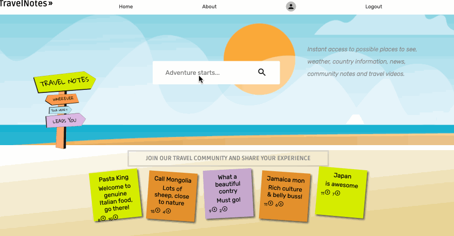
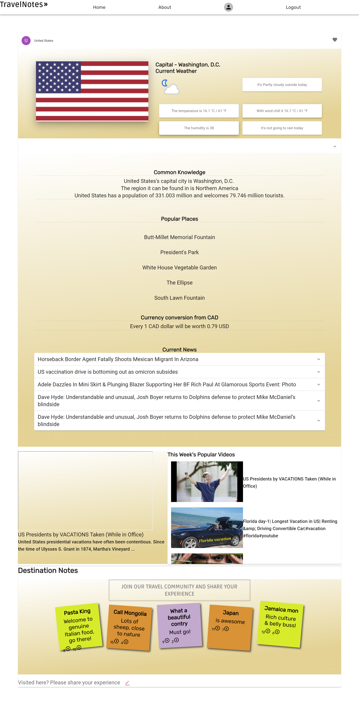
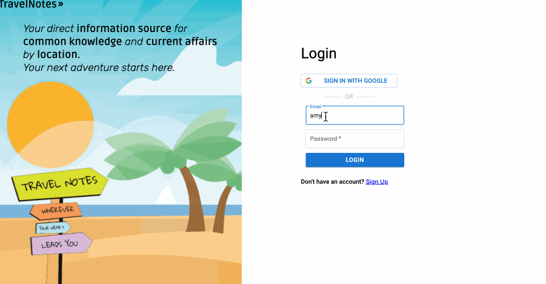
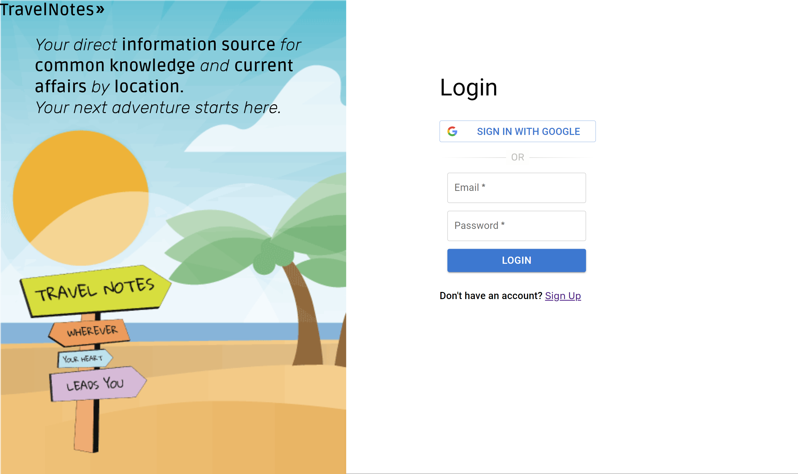
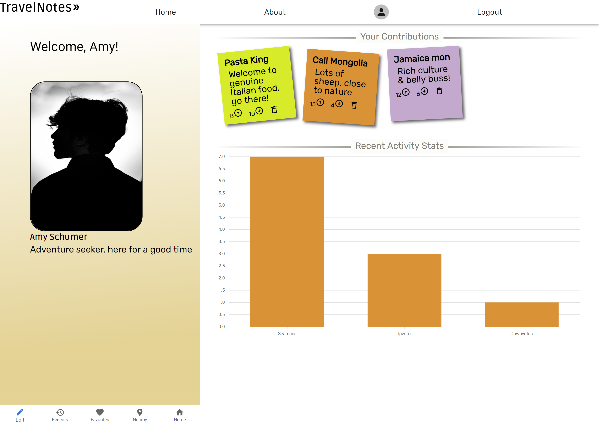
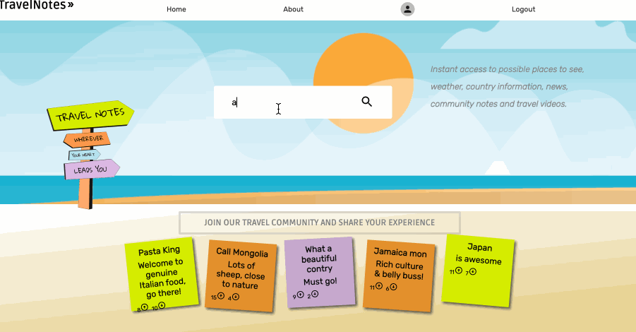
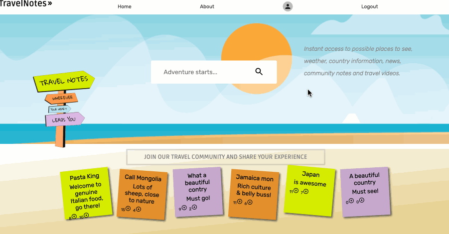
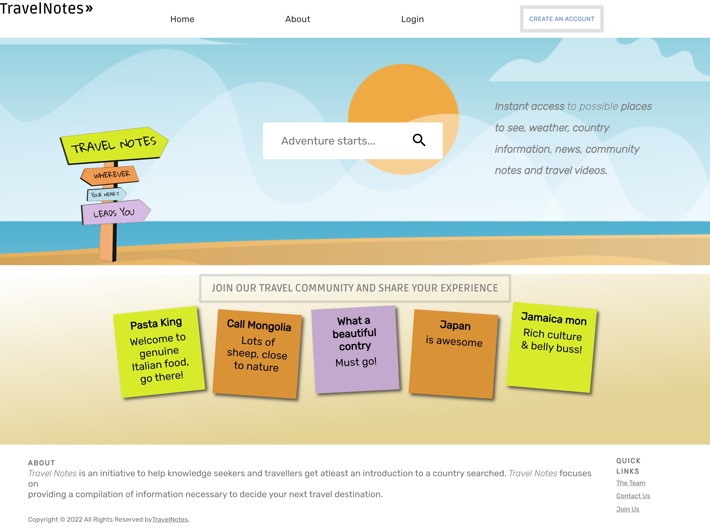
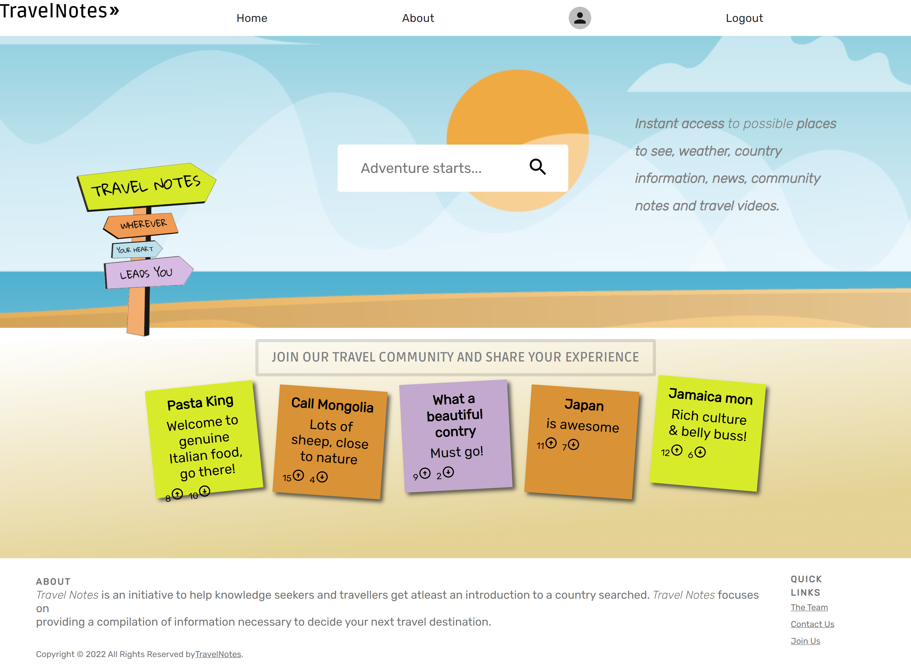

# TravelNotes

### Description

Travel Notes is a compilation of data sources to give users at least an introduction to the country searched, with the added bonus of joining a travel community. Contribute to the search data source as ‘notes’, by sharing your stories about traveling to a destination.

- A summary of the destination includes: 
  - National flag
  - Current weather
  - Basic stats eg. capital, region, population, tourist count for past year
  - Most visited attractions
  - Currency conversion
  - Current News
  - Trending/popular videos about the destination

### User Stories
- All users can type a travel destination in the search bar and have a page returned containing information available about that destination
- All users can join a travel community by creating an account
- Registered user can leave notes about a destination for others to view
- Registered user can see a list of their previous posted notes
- Registered user can manage their notes - view, add, delete
- Registered user can upvote a note
- Registered user can downvote a note

# Final Product

### Perform a search

### Login

### Add a note

### Delete a note

### Upvote and Downvote reflect count upon user selection

### Differed Home for user vs registered user

## Tech Stack

### Front-End
- Axios
- React
- Material UI
- CSS

### Back-End
- NodeJS

### Database
- Supabase built on Postgres

### Future developments
- Registered user can report a note
- Registered user can favorite a destination page
- Registerd user can filter community notes by destination.
- Admin functionality
  - Admin can review and delete notes according to community guidelines
  - Admin can pin notes to the top of the note pile and/or admin can make an announcement on top of page.

### Special Thanks
- Development Team: Micheala Palmer, Noya Onggud, Matthew Woods
- Mentors: Black Boys Code, Lighthouse Labs
- Youtube resources and open source forums
- Accessible APIs